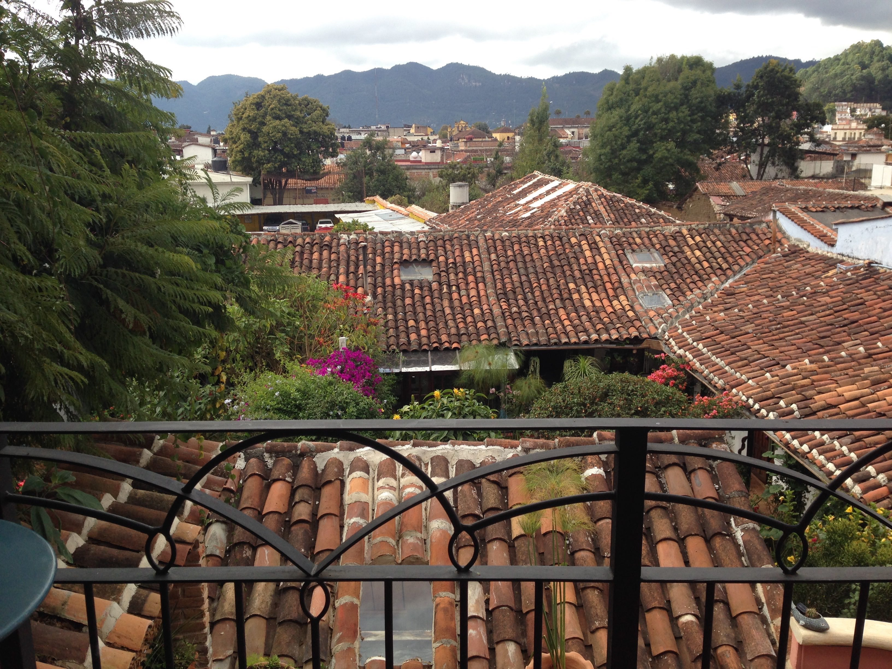
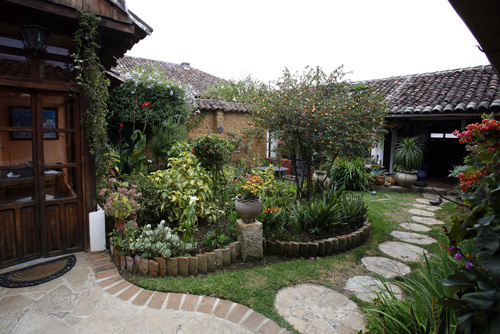
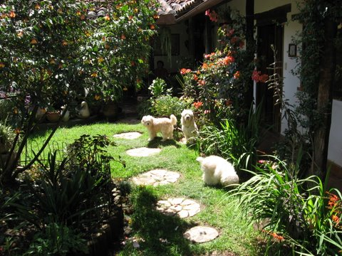
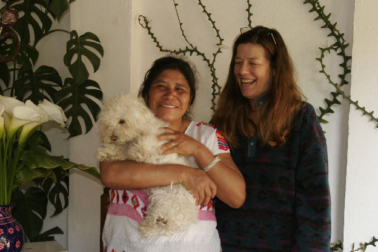

  

  <strong>Wi-Fi   </strong>We offer Wi-Fi internet connection for your convenience.

  <strong>Breakfast & Lunch   </strong>We are all lucky to have Manuela with us, who is reported to be the best cook south of the Rio Bravo! A full breakfast is included in your stay and served every morning between eight and ten. Lunch with us is offered Monday through Friday for 150 pesos. A notice the day before, including food preferences and needs is welcomed.

  <strong>Airport Pick Up   </strong>Trusted drivers may be contracted who will pick you up from the Tuxtla Gutierrez airport for 900 pesos per car and drop you off at the airport for 750 pesos. This is door to door service that we will arrange for.

  <strong>Laundry Service   </strong>We are happy to offer laundry service for a fee.

  <strong>Massage   </strong>Our on-site masseuse, Teresa, is available for deep tissue massage, one and a half hours, 500 pesos (about $30 USD). A wonderful way to relax at the end of a day of exploring.

  <strong>Baby Sitting Service   </strong>We are glad to offer babysitting for your child for 40 pesos an hour, day and night.

  

  

   
   
   
   
  

